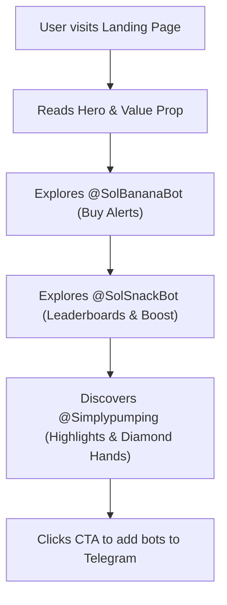

## 1. Product Overview
A dedicated landing page for the Solana Telegram Bot Ecosystem, showcasing the interconnected bots @SolBananaBot, @SolSnackBot, and the @Simplypumping channel.
- The ecosystem provides a comprehensive buy-bot and live-leaderboard experience for Solana tokens, designed for Telegram groups and channels.
- Target value: Increase adoption of the bots by highlighting their unique shared "1 brain" architecture, customizability, and gamified features like token score boosting and diamond hand tracking.

## 2. Core Features

### 2.1 Feature Module
1. **Hero Section**: Strong value proposition, call-to-actions (CTAs) to add the bots to Telegram.
2. **@SolBananaBot Module**: Showcases tracking features (groups/channels/topics), buy alerts, emoji themes, standard/IPFS picture banners.
3. **@SolSnackBot Module**: Explains the live leaderboard, shared database, custom scoring system, pagination rules (Top 30 global vs. Top 3 private chat), and the "boost token score for SOL" feature.
4. **@Simplypumping Channel Module**: Highlights the dedicated channel for hourly global leaderboard updates, diamond hand tracking (purchases >$1000), and boost shoutouts.

### 2.2 Page Details
| Page Name | Module Name | Feature description |
|-----------|-------------|---------------------|
| Home page | Hero section | Animated intro, headline, primary CTAs linking to bots. |
| Home page | Ecosystem Diagram | Visual representation of the "1 brain" shared database connecting BananaBot, SnackBot, and Simplypumping. |
| Home page | BananaBot Features | Cards detailing buy alerts, IPFS banners, emoji themes. |
| Home page | SnackBot Features | Interactive or visual breakdown of the leaderboard snippet, local vs global rank, and boost mechanics. |
| Home page | Pumping Highlights | Section explaining the @Simplypumping channel benefits, diamond hands alerts, and shoutouts. |

## 3. Core Process
The user flow for understanding and adopting the ecosystem:

## 4. User Interface Design
### 4.1 Design Style
- **Aesthetic**: Bold, energetic, "crypto-native" yet polished. Dark mode by default with vibrant neon accents (e.g., Solana Green/Purple, Banana Yellow).
- **Typography**: A striking modern display font for headings paired with a clean sans-serif for body text.
- **Colors**: Deep dark backgrounds (#0F172A or #000000), vibrant primary accents (Neon Yellow #FACC15 for Banana, Solana Purple #9945FF, Mint Green #14F195).
- **Layout style**: Asymmetric cards, glowing borders, overlapping elements to create depth, sticky header navigation.
- **Animations**: Scroll-triggered reveals, floating elements representing the bots, glowing hover effects on buttons and cards.

### 4.2 Page Design Overview
| Page Name | Module Name | UI Elements |
|-----------|-------------|-------------|
| Home page | Hero section | Large typography, glowing gradient text, dual CTA buttons (primary: Add Bot, secondary: Join Channel). |
| Home page | Ecosystem Map | Connected nodes with glowing animated paths representing data flow. |
| Home page | Bot Cards | Frosted glass (glassmorphism) containers with neon borders, custom icons or emojis for features. |

### 4.3 Responsiveness
Desktop-first approach, fully mobile-adaptive. Stacked cards on mobile, touch-friendly oversized buttons, optimized scroll performance.