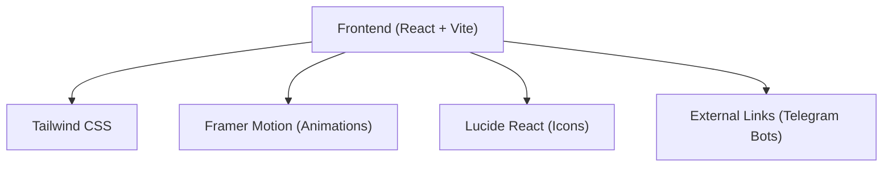

## 1. Architecture Design

## 2. Technology Description
- **Frontend**: React@18 + tailwindcss@3 + vite + framer-motion
- **Initialization Tool**: vite-init
- **Styling**: Tailwind CSS with custom theme variables (Solana Green, Purple, Banana Yellow) and CSS variables for glowing effects.
- **Icons**: lucide-react for consistent UI icons.
- **Animations**: framer-motion for scroll reveals, staggered entry animations, and hover micro-interactions.

## 3. Route Definitions
| Route | Purpose |
|-------|---------|
| / | Home landing page showcasing the ecosystem |

## 4. Components Architecture
1. **App**: Main container, handles global styling and layout.
2. **HeroSection**: Animated headline, value proposition, and primary CTAs linking to Telegram bots.
3. **EcosystemSection**: Visual representation of the "1 brain" shared database connecting BananaBot, SnackBot, and Simplypumping.
4. **FeatureSection**: Showcases @SolBananaBot features (buy alerts, IPFS banners, emoji themes).
5. **LeaderboardSection**: Details @SolSnackBot features (live leaderboard, global vs private pagination, boost mechanics).
6. **ChannelSection**: Explains @Simplypumping benefits (hourly updates, diamond hand tracking, boost shoutouts).
7. **Footer**: Social links, documentation links, and final CTA.